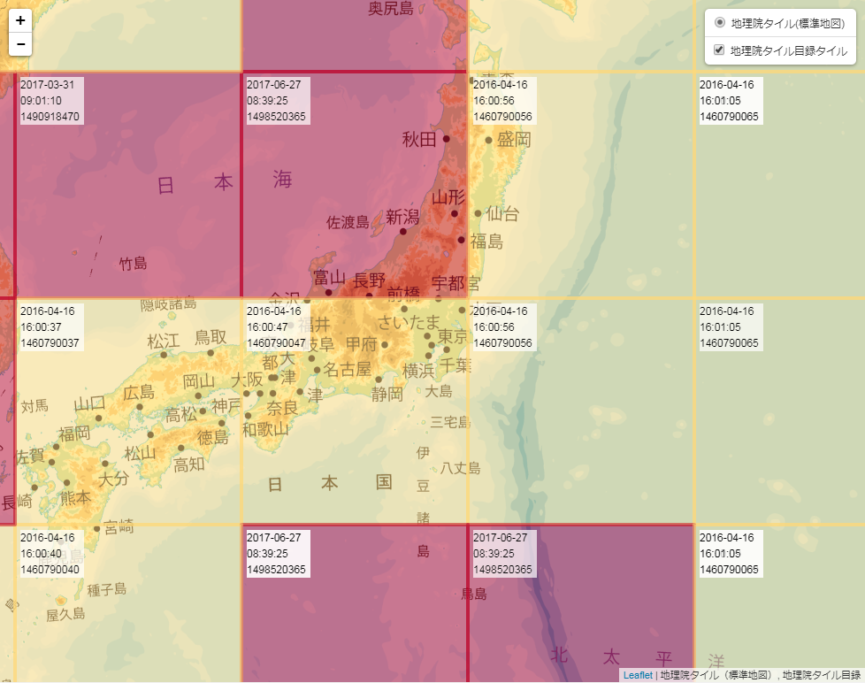

# Mokuroku-Vector

地理院地図の地理院タイル(標準地図)のタイル目録を取得してタイル毎の最終更新時刻をなんちゃってベクトルタイルにします｡
地理院タイル目録を使います｡地理院タイル目録の仕様は [github リポジトリ](https://github.com/gsi-cyberjapan/mokuroku-spec)をご覧ください｡

## 必要なもの

+ Node.js v8.10.0
+ SQLite3
+ bash

## 使い方

```
# git clone https://github.com/KMR-zoar/mokuroku-vector.git
# cd mokuroku-vector
# ./dbinitial.sh
# npm install
# npm start
```

`dbinitial.sh` で地理院タイル目録をダウンロードして SQLite3 のデータベースを用意します｡  
ダウンロードするファイルが約1GB､解凍して出てくる CSV が約3.5GB､できあがる SQLite3 のデータベースが約5GBそれぞれあるのでディスクの空き容量とご相談ください｡

サーバーをスタートさせると GeoJSON タイルや画像タイルとしてアクセスできるようになります｡

GeoJSON タイルの URL

```
http://%サーバーIP%:3000/{z}/{x}/{y}.json
```

画像タイルの URL

```
http://%サーバーIP%:3000/{z}/{x}/{y}.png
```

各 GeoJSON は次のような内容になっています｡

```
{
   "type": "FeatureCollection",
   "generator": "mokuroku-vector",
   "features": [
      {
         "type": "Feature",
         "properties": {
            "date": "%更新日付%",
            "time": "%更新時刻%",
            "unixtime": "%unixtime%",
            "tilePath": "%タイル画像のパス%"
         },
         "geometry": {
            "type": "Polygon",
            "coordinates": [%タイル画像の四方を囲う緯度経度のセット%]
         }
      }
   ]
}
```

## レンダリングサンプル



